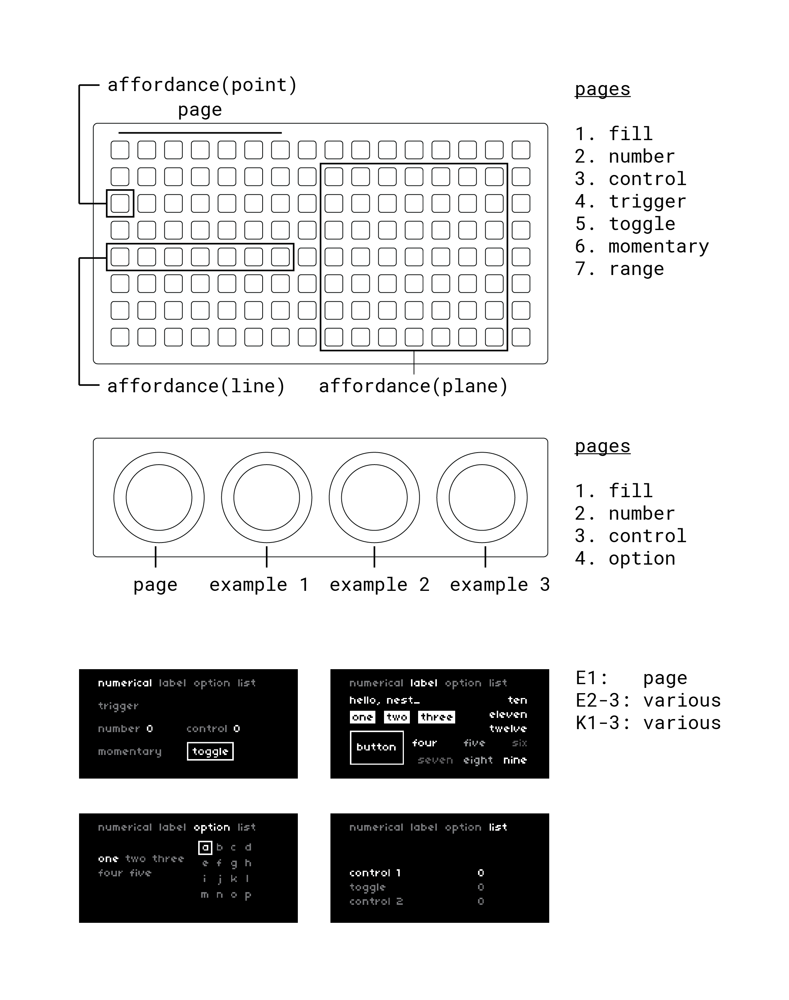

# look around

studies 1 & 2 covered the essential basic techniques of nest_ structures. we measured the depth of a lake - now is a good time to step back and observe the width (though, I like to think of nest_ as a network of underwater caves).

the library affordances are split into three optional modules, each operating on specific hardware. here is an overview of each:

| module       | hardware | output type | hardware key-value pairs | groups |
| ---          | ---      | ---    |---             | ---
| `grid` | grid | light | `g = grid.connect(n)` | `_grid` |
| `arc` | arc | light |`a = arc.connect(n)` | `_arc`, `_arc.key` |
| `txt` | keys, encoders, screen | text | `screen = screen, key = key, enc = enc` | `_txt`, `_txt.enc`, `_txt.key` |

in review:

- a module is included like this:
```
include "lib/nest/<module>"
```
- hardware is connected to a nest like this (you can connect multiple key-value pairs to one nest):
```
my_nest:connect {
    <key-value pairs>
}
```
- affordances from a module are created like this:
```
my_affordance = <group>.<affordance type> {
    --
}
```
you've already been doing this with `grid`, but now you have some formality to things ;)

# affordance types

rather than a long list of terms & behaviors, there are 10 affordance types - each utimately with seperate implimentations in every group that uses it - but some similarities overall. 

overview:

| type | value | descripton | `_grid` | `_arc` | `_arc.key` | `_txt` | `_txt.enc` | `_txt.key` |
| --- | --- | --- | --- | --- | --- | --- | --- | --- |
| `fill` | none | a static display of light | x | x | | | | |
| `label` | string | a static display of text | | | | x | | |
| `number` | integer or decimal | a point in space | x | x | | | x | x |
| `control` | decimal | a number bound by an internal `controlspec` | x | x | | | x | |
| `option` | decimal | an index in a range of options. should be rounded down before use. | | x | | | x | x |
| `list` | decimal | an option that selects from a list of other affordances | | | | | x | x |
| `range` | two integers | two numbers in a table, denoting a slice of a whole | x | | | | | |
| `trigger` | 0 or 1 | an instantaneous bang, value is used only for display | x | | x | | | x |
| `toggle` | integer | cycles forward through a list of numbers, but usually just 0 and 1 | x | | x | | | x |
| `momentary` | 0 or 1 | becomes 1 on a rising edge, 0 on a falling edge | x | | x | | | x |

note in the case of `_grid`, `_txt`, `_txt.enc`, `_txt.key`, the value may be a table or nested tables of numbers or string. `_arc.key` is only for the 2011 edition arcs that had pushbuttons. I happen to have one of them :)

# properties

as much as possible, the names and behaviors of properties are shared throughout a group, and sometimes across groups. I won't list all of the properties here, instead, reference the module docs. the docs contain a complete list of every affordance and meta-affordance in the module, along with a list of properies and what affordances they belong to. while exploring the study script, I encourage you to reference the docs to take in specific information:

- [`nest/grid`](../doc/grid.md)
- [`nest/arc`](../doc/arc.md)
- [`nest/norns`](../doc/norns.md)
- [`nest/txt`](../doc/txt.md)
- [`nest/core`](../doc/core.md)

# example

the study 3 script is a demo of all the affordance types and thier unique iterations on grid, arc, and norns. interact with the script, and reference the source code and module docs to learn about interactions that interest you. every affordance has an action function that will print it's value to the REPL.

for the grid, each affordance type is on a page three times, so you can understand how the behavior changes when inititalized as a point (e.g., `x = 1, y = 3`), a line (e.g., `x = { 1, 7 }, y = 5`), and a plane (e.g., `x = { 9, 15 }, y = { 2, 8 }`). the grid action functions also print a full list of arguments received, which you'll learn more about in the next study.



# continued

- part 1: [nested affordances](./study1.md)
- part 2: [multiplicity](./study2.md)
- part 3: affordance overview
- part 4: [state & meta-affordances](./study4.md)
